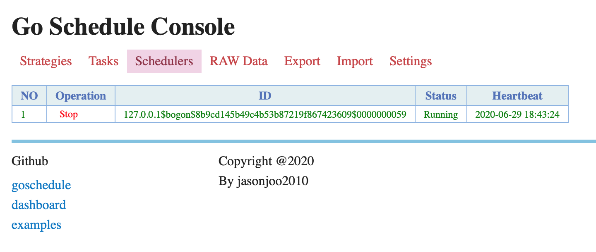
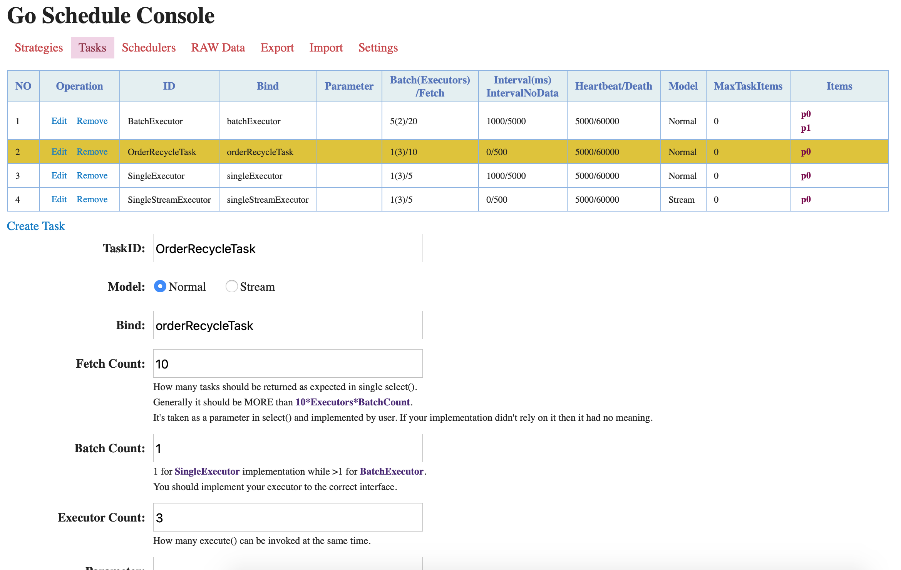
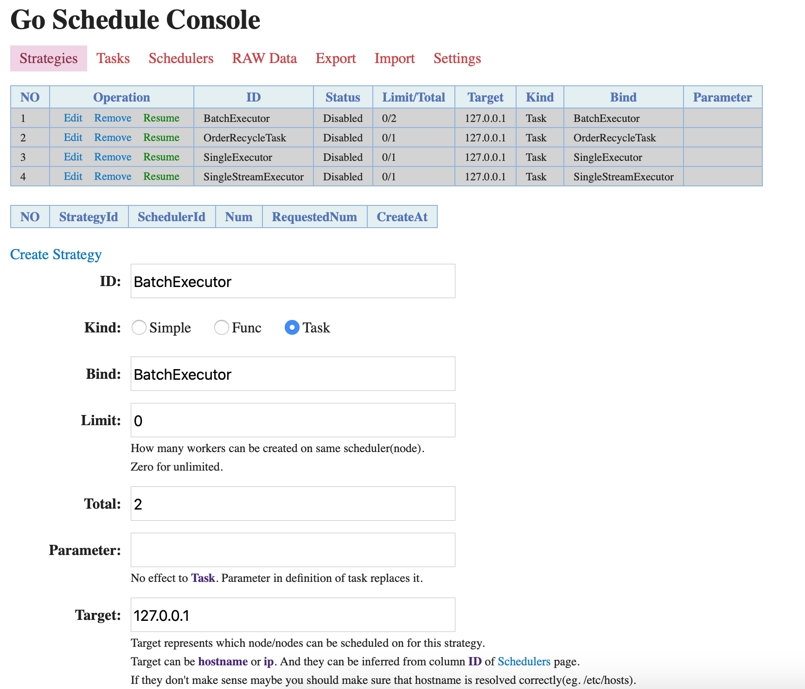
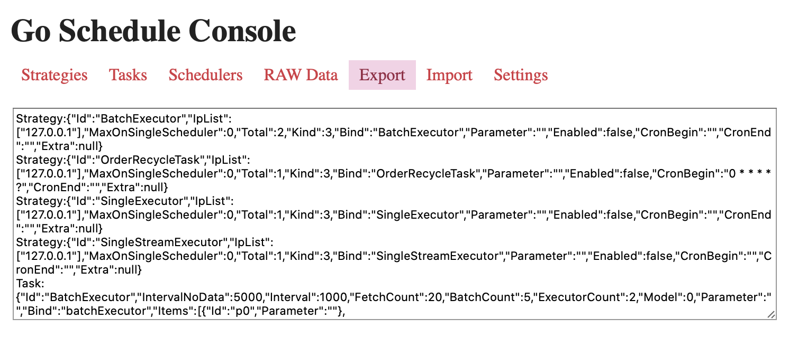
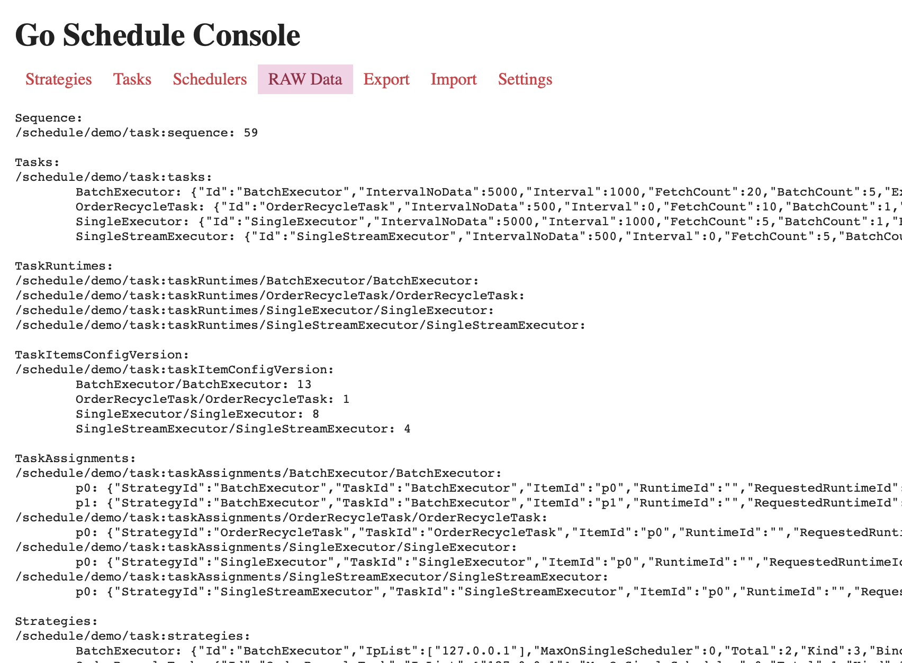

# goschedule-console

Console tool for goschedule

## Quick Start

```shell
go build .
./goschedule-console -v
```

Then you can open `http://127.0.0.1:8000/` in your browser to use it.

## Parameters

Para | Comment
--- | ---
-v | Enable verbose logging(default to disabled)
-p | Set serving port(default to 8000)
-c | Specify config file location(default to "config.yml" in workdir, configuration will be written to it)

## Screenshots

### Schedulers Panel

Scheduler panel lists all the schedulers online and you can perform stop/resume operations on any of them.



### Settings Panel

You can modify the settings on this panel.



### Strategy Panel

Strategy panel lists all the strategies defined in namespace. You can pick any of the running ones to see the distributed table. It will be refreshed on every click.



### Task Panel

Task panel lists all the tasks defined. You can pick any of them to see the runtime information. Again it will be refreshed on every click.


### Export/Import Panel

Export/Import panel is a pair of tools very conviniencely migrate from one backend to another or one evironment to another, partly or completely. And task/strategy with the same `ID` will not be overwritten when importing and it will be represents on message popped. One record a line and tasks begin with `Task:` and strategies begin with `Strategy:`.



### Store Panel

If you are curious with the inside of store you can use store panel to look around.


